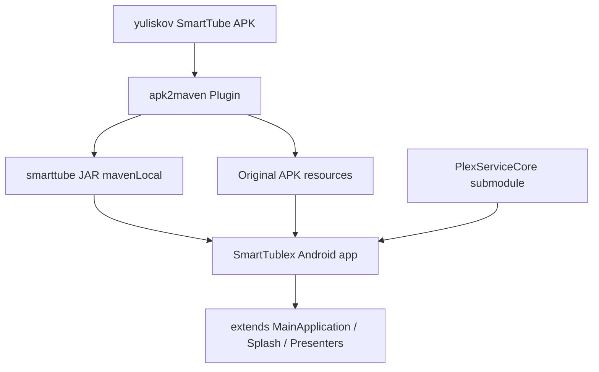

# SmartTublex: Rules, Wrapper-App, Plex-Meilenstein

Umsetzungsplan für SmartTublex als Android-TV-Wrapper über apk2maven (Upstream-SmartTube-APK) mit späterem Plex-Meilenstein über PlexServiceCore.

## Ausgangslage

- SmartTublex ist ein Kotlin-JVM-Scaffold mit apk2maven → `com.liskovsoft.smarttubetv:smarttube:latest` (yuliskov-APK) und Smoke-Check `src/main/kotlin/com/smarttublex/SmartTubeClasspathCheck.kt`.
- Im installierten JAR sind zentrale Klassen **nicht obfuscated** und **öffentlich erweiterbar** (u. a. `MainApplication`, `SplashActivity`, `MotherActivity`, `BasePresenter`, `BrowsePresenter`). Fork-only-Typen wie `MediaSourceRegistry` fehlen dort (korrekt für Upstream-Basis).
- Plex ist im SmartTube-Quellfork bereits source-seitig fertig (`PlexServiceCore` + FORK-Hooks). Ziel hier: dieselbe Fähigkeit **im Wrapper** über Vererbung/neue Klassen, ohne SmartTube-Source zu patchen.
- apk2maven liefert JAR + Original-APK (`classifier=apk`); Ressourcen-/App-Packaging ist laut Plugin-Doku noch Folgearbeit — wir schließen das in SmartTublex.

**Defaults (festgelegt):**

- Basis-APK bleibt **yuliskov/SmartTube** (aktueller apk2maven-URL) — Plex wird neu im Wrapper gebaut.
- Startbare App per **Android-Application-Modul**: Compile gegen SmartTube-JAR, Ressourcen aus der Original-APK, Manifest zeigt auf SmartTublex-Subklassen.
- Plex nutzt das bestehende Repo [axelsteffen/PlexServiceCore](https://github.com/axelsteffen/PlexServiceCore) (Submodule), Patterns aus dem SmartTube-Fork als Vorlage, aber als Wrapper-Code statt `// FORK:`-Patches.

## Implementation todos

| ID | Inhalt | Status |
|----|--------|--------|
| `copy-rules-skills` | Rules/Skills einzeln auf Sinnhaftigkeit prüfen; nur passende übernehmen/umschreiben (Sync = Artifact reload+install); fork-docs Gerüst | pending |
| `android-wrapper-boot` | Android `:app` Modul: Subklassen, Manifest, Ressourcen; Debug-APK per adb auf TV-Gerät installierbar und manuell testbar | pending |
| `plex-submodule` | PlexServiceCore als Submodule einbinden und Gradle-Module gegen SmartTube-JAR verdrahten | pending |
| `plex-milestone-slice` | `MILESTONE_PLEX_INTEGRATION` in fork-docs anlegen; Phase 0–2 im Wrapper (Registry, Adapter, ein Playback) umsetzen | pending |

---

## Phase 1 — Rules und Skills: prüfen, dann anpassen (kein Blind-Copy)

**Prinzip:** Jede Rule/Skill aus SmartTube wird **vor dem Übernehmen auf Sinnhaftigkeit geprüft**. Übernehmen nur, was im Wrapper-Modell sinnvoll ist; sonst weglassen oder neu schreiben. Pfade, Upstream-Begriff und Sync-Semantik müssen zu SmartTublex passen.

**Sync-Definition (verbindlich):** Bei SmartTublex bedeutet Synchronisation **nicht** Git-Merge mit yuliskov, sondern:

1. SmartTube-APK erneut laden (apk2maven `downloadApk`)
2. DEX→JAR und Installation nach `mavenLocal` (`installApkArtifact`)
3. Danach Build/Smoke, damit Wrapper gegen das frische Artifact kompiliert

Aliases wie `sync`, `sync smarttube`, `refresh artifact`, `update artifact`, `upstream sync` → dieser Workflow.

### Sinnhaftigkeitsprüfung: Rules

| SmartTube-Rule | Urteil | Begründung / SmartTublex-Aktion |
|----------------|--------|----------------------------------|
| `graphify.mdc` | **Übernehmen** | Gilt unverändert; graphify-out existiert bereits. |
| `milestone-progress.mdc` | **Übernehmen** (leicht anpassen) | Plex-Meilenstein braucht weiterhin eigene Docs unter `fork-docs/milestones/`. TV-Ressourcen-Hinweise behalten. Index-Pfad auf SmartTublex `fork-docs/README.md`. |
| `milestone-implementation-workflow.mdc` | **Übernehmen** | Ansatz-vor-Code ist unabhängig vom Packaging; unverändert sinnvoll. |
| `fork-upstream-minimal.mdc` | **Umschreiben** (nicht 1:1) | `// FORK:`-Patches in Upstream-Source und MSC-Policy passen nicht. Neu: Isolation nur in SmartTublex-Quellen; Upstream nur als **Artifact** (keine Dekompilat-Edits); Erweiterungen per Vererbung/neue Klassen; Touch-Points = überschriebene/eingeführte Wrapper-Typen dokumentieren. |
| `changelog-fork.mdc` | **Anpassen** | Changelog behalten, aber **ohne** `MediaServiceCore/CHANGELOG_FORK.md`. Abschnitte z. B. `app`, `PlexServiceCore`, `build`/apk2maven. „Fork-spezifisch“ = alles, was vom reinen Upstream-Artifact abweicht. |
| `fork-commands.mdc` | **Umschreiben** | Registry neu (siehe unten). Git-Merge-Commands (`continue merge`, `sync yuliskov` als Merge) **entfernen** bzw. auf Artifact-Sync umbiegen. |

**Nicht aus SmartTube/.claude übernehmen** (außer explizit gewünscht): `rest-shell`, Claude-`graphify`-Skill-Duplikat — nicht Teil von `.cursor` und für den Wrapper-Kern nicht nötig. Workspace-graphify-Rule reicht.

### Sinnhaftigkeitsprüfung: Skills

| SmartTube-Skill | Urteil | Begründung / SmartTublex-Aktion |
|-----------------|--------|----------------------------------|
| `upstream-merge/` | **Nicht kopieren** — **ersetzen** | `merge-upstream.sh`, SharedModules→MSC→SmartTube, Conflict-Resolution sind Quell-Fork-Workflow. Stattdessen neuer Skill z. B. `artifact-sync/SKILL.md`. |
| `fork-git/` | **Anpassen** | Conventional Commits behalten. Scopes neu: `app`, `psc`, `fork-docs`, `build`, `plex`, `artifact`. Submodule-Reihenfolge: nur `PlexServiceCore` vor Root (kein MSC). Push-Hinweise ohne MSC. |

#### Neuer Skill: `artifact-sync` (ersetzt upstream-merge)

Workflow-Skizze:

1. **Status (immer zuerst bei unsicherem Sync):** prüfen, ob Artifact in `~/.m2/.../smarttube/` existiert; konfigurierte APK-URL/`version` aus `build.gradle.kts`; optional Alter/Hash der installierten APK vs. Download.
2. **Sync ausführen:** `./gradlew installApkArtifact` (JDK 21, echtes `GRADLE_USER_HOME` falls nötig) — lädt APK neu, dex→JAR, installiert nach mavenLocal.
3. **Nach Sync:** abhängige Compile-/Smoke-Tasks (z. B. `:app:assembleDebug` sobald vorhanden); Hinweis auf Changelog-Eintrag bei bewusstem Base-Update.
4. **Kein** Git-Merge, kein Conflict-Continue, kein Force-Push.

`reference.md` des alten Merge-Skills **nicht** übernehmen (Fork-Touch-Points der Source-Patches). Stattdessen kurze Referenz: GAV, Task-Namen, Credential-Hinweise (`gpr.user`/`gpr.key`).

### Command-Registry (SmartTublex) — Zielbild

In `.cursor/rules/fork-commands.mdc` + `fork-docs/COMMANDS.md`:

| Command ID | Aliases (Beispiele) | Aktion |
|------------|---------------------|--------|
| `artifact-sync` | `sync`, `sync smarttube`, `refresh artifact`, `update artifact`, `upstream sync`, `reload artifact` | Skill `artifact-sync`: APK neu laden + `installApkArtifact` |
| `artifact-status` | `artifact status`, `upstream status`, `base status`, `apk status` | Nur Status des installierten Artifacts melden — **kein** Re-Download außer explizit Sync |
| `milestone-status` | `milestone status`, `meilenstein status`, … | Aktuelles Milestone-Doc lesen, Fortschritt melden |
| `next-step` | `next step`, `nächster schritt`, … | Milestone-Workflow (Discuss → Confirm → Implement) |
| `log-change` | `log change`, `changelog`, … | `fork-docs/CHANGELOG.md` (ohne MSC-Changelog) |
| `git-commit` / `git-push` / `commit-push` | wie bisher | `fork-git` angepasst |
| `fork-help` | `fork help`, `commands`, … | COMMANDS.md |

**Entfernen / nicht übernehmen:** `continue merge`, `merge continue`, `conflicts resolved`, sowie jede Semantik von „yuliskov git merge“.

### fork-docs Gerüst

Anlegen (nicht blind volle SmartTube-Architektur-Docs kopieren):

- `fork-docs/README.md` — Wrapper-Modell, Artifact-Basis, PlexServiceCore
- `fork-docs/CHANGELOG.md` — `[Unreleased]`, Abschnitte passend zu SmartTublex
- `fork-docs/COMMANDS.md` — Registry oben
- `fork-docs/milestones/` — Platz für Plex (Phase 3)
- **Nicht** übernehmen: `merge-upstream.sh`, `UPSTREAM_MERGE.md` (Git-Merge-Topologie) — ersetzen durch kurze `ARTIFACT_SYNC.md` (URL, Tasks, Sync-Bedeutung)

---

## Phase 2 — Wrapper-App, die startet

### 2.1 Gradle / Module

- Root von reinem Kotlin-JVM auf **Multi-Project** umstellen:
  - `:app` — Android Application (AGP, Leanback/TV), `applicationId` z. B. `com.smarttublex`
  - optional Root behält apk2maven-Konfiguration (oder eigenes `:apk-base`-Modul), das `installApkArtifact` vor Compile sicherstellt
- Repos: `mavenLocal()`, `google()`, `mavenCentral()`; JDK **21** (wie bisher)
- Dependency: `implementation("com.liskovsoft.smarttubetv:smarttube:latest")` im `:app`-Modul
- `compileKotlin`/`preBuild` hängt an `installApkArtifact`

### 2.2 Vererbte Einstiegsklassen (später erweiterbar)

Minimale Subklassen in `com.smarttublex.*`, die zunächst nur `super` aufrufen:

- `SmartTublexApplication` extends `MainApplication`
- `SmartTublexSplashActivity` extends `SplashActivity` (oder Manifest lässt Splash und setzt nur `android:name` der Application — bevorzugt beides, damit Override-Punkte klar sind)

`AndroidManifest.xml` der Upstream-App als Vorlage: Launcher/`LEANBACK_LAUNCHER`, Application-Name auf Wrapper-Klassen.

### 2.3 Ressourcen / Packaging (Default)

Damit die App **wirklich startet** (nicht nur kompiliert):

1. Task (Gradle): Original-APK (`…-apk.apk` aus mavenLocal) entpacken und `res/`, `assets/`, `resources.arsc`, ggf. native `lib/` nach `app/src/main/` bzw. Build-Intermediate spiegeln (generiert, gitignore).
2. AGP baut die Wrapper-APK: Upstream-Klassen aus JAR + SmartTublex-Subklassen + gespiegelte Ressourcen.
3. Signing: **debug** keystore (ausreichend für Sideload auf dem TV).

### 2.4 TV-Gerätetest (Pflicht nach Punkt 2)

Nach Umsetzung von Phase 2 muss ein **manueller Test auf einem physischen Android-TV-Gerät** möglich sein — nicht nur Emulator/Compile-Erfolg.

Konkret liefern:

| Deliverable | Inhalt |
|-------------|--------|
| Installierbare APK | `./gradlew :app:assembleDebug` (oder gleichwertig) erzeugt eine sideloadbare Debug-APK |
| Deploy-Weg | Kurze Anleitung in `fork-docs` (oder README): `adb connect <tv-ip>`, `adb install -r app-debug.apk` (USB oder Netzwerk-ADB) |
| Manifest/TV | `LEANBACK_LAUNCHER` / TV-Feature-Flags so gesetzt, dass die App im TV-Launcher erscheint |
| Smoke auf Gerät | App startet auf dem TV; Splash → Browse; erkennbar, dass der Wrapper läuft (Logcat-Tag oder sichtbarer Debug-Hinweis aus `SmartTublexApplication`) |

**Exit-Kriterium Phase 2:** Debug-APK ist per adb auf dem TV installiert und gestartet; Browse wie Upstream erreichbar; Wrapper-Klassen liegen auf dem Startup-Pfad. Phase 3 beginnt erst danach.

---

## Phase 3 — Plex-Meilenstein nachbauen (vorhandenes Repo)

### 3.1 Repo einbinden

- Git-Submodule `PlexServiceCore` → `https://github.com/axelsteffen/PlexServiceCore.git`
- Gradle: `:plexserviceinterfaces` / `:plexapi` wie in SmartTube `core_settings.gradle`, aber **Compile gegen SmartTube-JAR** für `mediaserviceinterfaces` / `sharedutils` (keine MSC-Source-Kopie nötig, sofern Typen im JAR sind)
- Milestone-Doc: `fork-docs/milestones/MILESTONE_PLEX_INTEGRATION.md` aus SmartTube kopieren und Status auf „todo“ setzen; Fortschritt nach Milestone-Progress-Rule pflegen

### 3.2 Umsetzung im Wrapper (nicht als Source-Fork-Hooks)

Vorlage bleibt der fertige SmartTube-Fork, Umsetzung aber als **SmartTublex-eigene Klassen** + Overrides:

| Meilenstein-Inhalt | Wrapper-Ansatz |
|--------------------|----------------|
| Phase 0 Registry/Sidebar | `MediaSourceRegistry`, `SidebarSectionRegistry` als **neue** Klassen in SmartTublex; Einstieg über überschriebene Presenter/Application-Hooks |
| Phase 1–2 API/Adapter | bestehenden Code aus `PlexServiceCore` nutzen; Adapter/Playback-Helfer nach SmartTublex portieren (`PlexPlaybackHelper`, Video-Source-Tagging wo nötig per Subklasse/Decorator) |
| Phase 3 Browse UI | `PlexBrowsePresenter` + Sidebar; Anbindung über Subklasse von `BrowsePresenter` **oder** ViewManager-Registrierung in `SmartTublexApplication` (je nachdem, was die JAR-Sichtbarkeit von `setupViewManager`/Hooks hergibt — zuerst Sichtbarkeit prüfen, dann kleinsten Override wählen) |
| Phase 4–5 Polish | Resume, Untertitel, Audio, YT-Feature-Gates, Transcode, Errors — analog Fork, aber in Wrapper-Dateien |

**Explizit nicht:** SmartTube-Quellrepo weiter mit Plex-Patches füllen; Ziel ist Isolation im Wrapper.

Exit-Kriterium Phase 3 (erstes vertikales Slice): Plex-Login → Library-Row → ein Film spielt über bestehenden Player. Restliche Phasen danach schrittweise laut Milestone-Workflow (Ansatz diskutieren → implementieren).

---

## Reihenfolge der Arbeit

1. Rules/Skills **prüfen → selektiv übernehmen/umschreiben** + `fork-docs` (inkl. `ARTIFACT_SYNC.md`, neuer `artifact-sync`-Skill); Sync-Semantik = Artifact reload+install
2. Android `:app` + Vererbungs-Skeleton + Ressourcen-Spiegelung → **Debug-APK auf TV-Gerät testbar** (adb install + Smoke Splash→Browse)
3. `PlexServiceCore` Submodule + Milestone-Doc
4. Plex Phase 0→2 (Registry, API, ein Playback), dann Browse/Polish

## Risiken (bewusst eingeplant)

- **Private Hooks** in Upstream (z. B. `setupViewManager`): ggf. Reflection oder breitere Overrides nötig — früh in Phase 2/3 prüfen.
- **Duplikate / Multidex / native libs**: Packaging-Task muss `lib/` und Multidex aus Original-APK korrekt übernehmen.
- **PlexServiceCore vs. JAR-Classpath**: erste Compile-Runde kann fehlende transitive Typen zeigen → gezielt ergänzen (weitere Classes aus JAR oder schlanke Stubs vermeiden, lieber Artifact-Abhängigkeiten klären).
